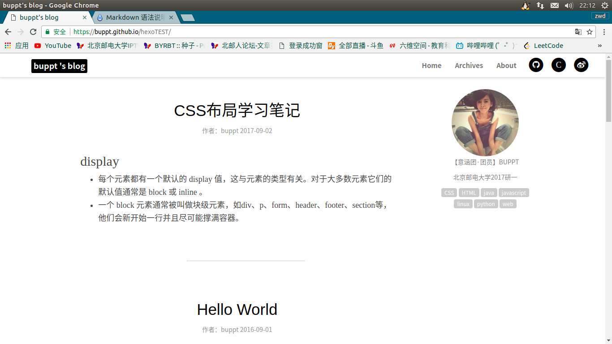
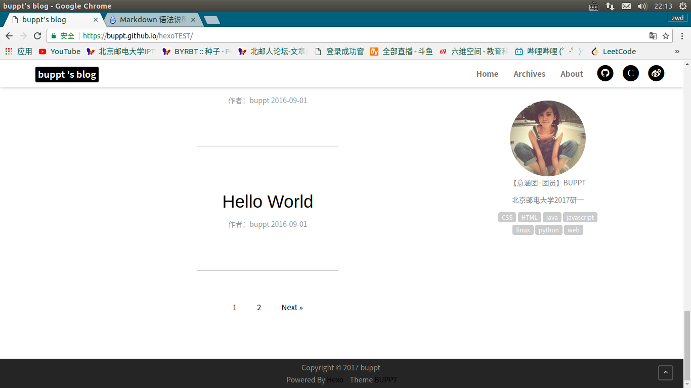
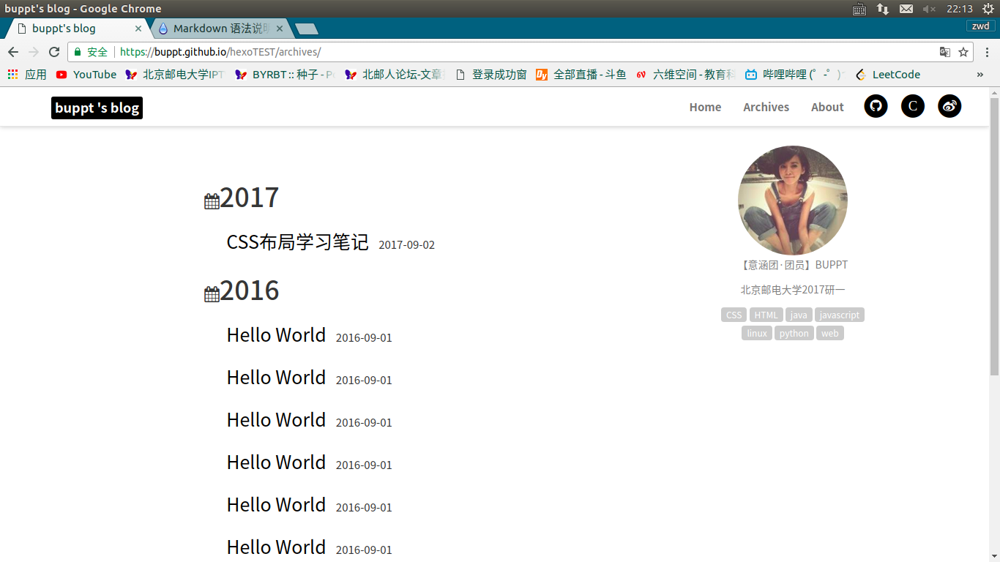
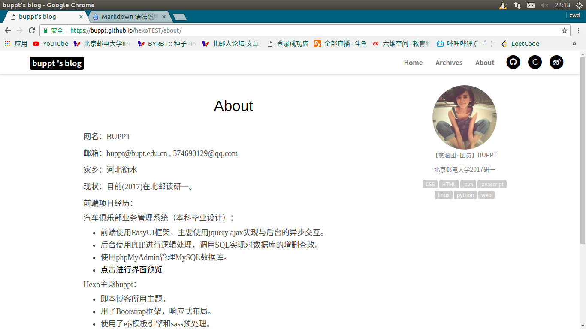
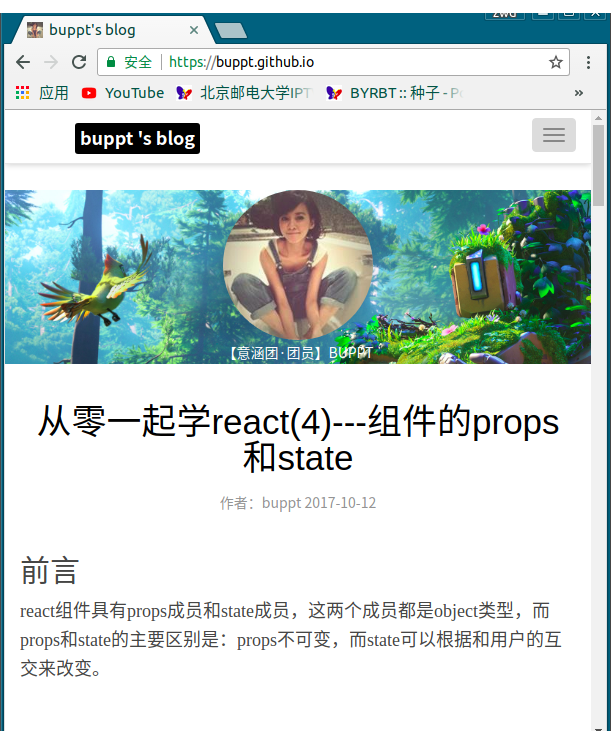

## 版本
这是一个黑白风格的hexo主题，界面非常简洁。

用户可以修改博客名称，右侧栏中个人头像，个人名称，个人简介，文章中写的tags会自动显示在个人简介下面。具体使用方式在截图后面。

现在算1.0版本把，<a href="https://buppt.github.io">界面及功能预览可点击这里查看我的个人主页</a>。

大家有什么想法欢迎留言。

## 界面截图






## 使用方式
hexo的使用方法可以<a href="https://hexo.io/zh-cn/docs/">点击这里查看官方文档</a>，写的还是非常详细的。有不懂的地方可以给我留言询问。

安装好hexo后，换成buppt主题的方法如下：

clone或下载本仓库，解压，把buppt文件夹拷贝到themes文件中，把hexo文件夹中的_config.yml中的theme改成buppt。

打开buppt文件夹，打开_config.yml文件，将csdn、github、weibo地址换成自己的地址，author改成自己的博客名称，
name的内容是博客头像下面显示的个人昵称，
introduce的内容是头像及名称下面要显示的个人介绍，
个人头像替换source/img/photohead.png图片即可。

写文章时，存在的tags会自动显示在头像的下面。
## 添加github issues作为博客留言板
---
使用github issues做评论系统是imsun大神的github项目gitment，更多github issues做留言板的使用<a href="https://github.com/imsun/gitment">可点击这里查看该项目仓库。</a>

下面介绍使用方法：
### 1.注册 OAuth Application
<a href="https://github.com/settings/applications/new">点击此处</a>来注册一个新的 OAuth Application。其他内容可以随意填写，但要确保填入正确的 callback URL（一般是评论页面对应的域名，如 https://buppt.github.io）。

你会得到一个 client ID 和一个 client secret，这个将被用于之后的用户登录。
### 2.引入gitment
gitment现在已经写入本主题中，只需修改buppt文件夹下，_config.yml文件中的以下内容即可。
```
gitment:
  owner: 你的 GitHub ID,//如buppt
  repo: 存储评论的仓库名,//如buppt.github.io
  client_id: 你的 client ID,
  client_secret: 你的 client secret,

```
### 3.初始化评论
页面发布后，你需要访问页面并使用你的 GitHub 账号登录（请确保你的账号是第二步所填 repo 的 owner），点击初始化按钮。

之后其他用户即可在该页面发表评论。
