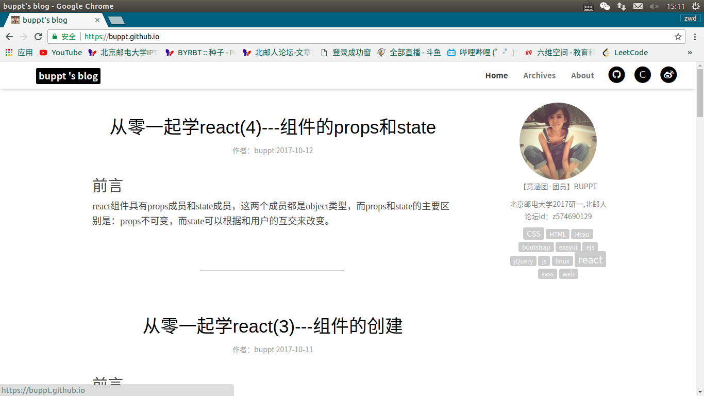
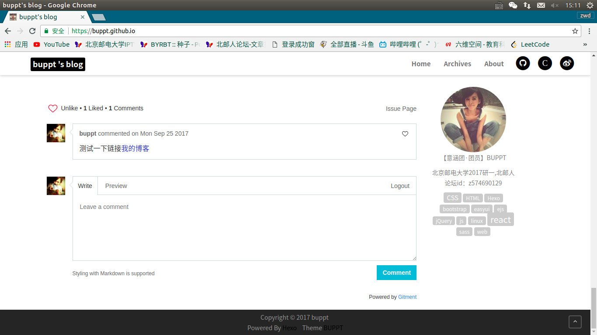

## 版本
这是一个黑白风格的hexo主题，界面非常简洁。

用户可以修改博客名称，右侧栏中个人头像，个人名称，个人简介，文章中写的tags会自动显示在个人简介下面。具体使用方式在截图后面。

现在算1.0版本把，<a href="https://buppt.github.io/hexoTEST">界面及功能预览可点击这里</a>。

正在做评论系统和界面美化，大家有什么想法欢迎留言。

## 界面截图

## 使用方式
hexo的使用方法可以<a href="https://hexo.io/zh-cn/docs/">点击这里查看官方文档</a>，写的还是非常详细的。

安装好hexo后，换成buppt主题的方法如下：

clone或下载本仓库，解压，把buppt文件夹拷贝到themes文件中，把hexo文件夹中的_config.yml中的theme改成buppt。

打开buppt文件夹，打开_config.yml文件，将csdn、github、weibo地址换成自己的地址，author改成自己的博客名称，
name的内容是博客头像下面显示的个人昵称，
introduce的内容是头像及名称下面要显示的个人介绍，
个人头像替换source/img/photohead.png图片即可。

写文章时，存在的tags会自动显示在头像的下面。
